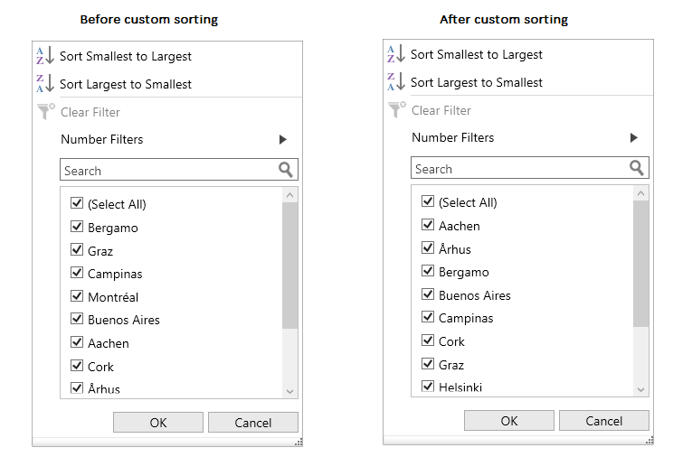

# How to sort checkbox items in the FilterPopup based on the DisplayValue?

## About the sample

This sample illustrates how to sort checkbox items in the FilterPopup based on the DisplayValue.

By default, in [WPF DataGrid](https://www.syncfusion.com/wpf-ui-controls/datagrid)(SfDataGrid) [GridComboBoxColumn](https://help.syncfusion.com/cr/wpf/Syncfusion.UI.Xaml.Grid.GridComboBoxColumn.html) the checkbox elements in the FilterPopup will be sorted based on the edit value (SelectedValuePath) of the column. You can sort the checkbox elements in the FilterPopup based on the display value (DisplayMemberPath) of the column by using a custom sort comparer for the filter elements in the [SfDataGrid.FilterItemsPopulated](https://help.syncfusion.com/cr/wpf/Syncfusion.UI.Xaml.Grid.SfDataGrid.html#Syncfusion_UI_Xaml_Grid_SfDataGrid_FilterItemsPopulated) event.

```c#

private void DataGrid_FilterItemsPopulated(object sender, Syncfusion.UI.Xaml.Grid.GridFilterItemsPopulatedEventArgs e)
{
    (e.ItemsSource as List<FilterElement>).Sort(new FilterElementComparer());
}


public class FilterElementComparer : IComparer<FilterElement>
{
    public int Compare(FilterElement x, FilterElement y)
    {
        if (x == null)
        {
            if (y == null)
            {
                // If x is null and y is null, they're 
                // equal. 
                return 0;
            }
            else
            {
                // If x is null and y is not null, y 
                // is greater. 
                return -1;
            }
        }
        else
        {
            // If x is not null... 
            // 
            if (y == null)
            // ...and y is null, x is greater. 
            {
                return 1;
            }
            else
            {
                return x.DisplayText.CompareTo(y.DisplayText);
            }
        }
    }
}

```



## Requirements to run the demo
Visual Studio 2015 and above versions
